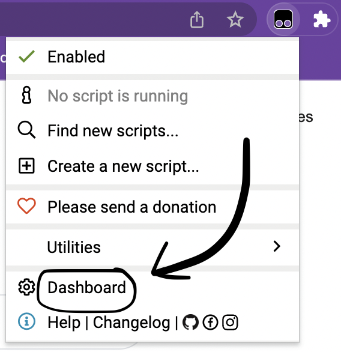
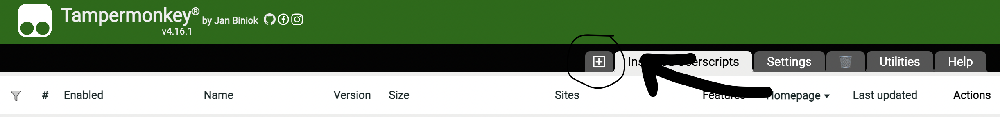

how to use, in 5 simple steps!

1. [download tampermonkey for chrome](https://chrome.google.com/webstore/detail/tampermonkey/dhdgffkkebhmkfjojejmpbldmpobfkfo)

2. [generate personalised script](https://emilia-tennant.github.io/generate.html) (press the back arrow when you're done.)

3. click on the brower extension you intalled in step 1, then click on dashboard.

4. click on the plus symbol.

5. delete all the contents in the editor then paste the script you generated in step 2.

